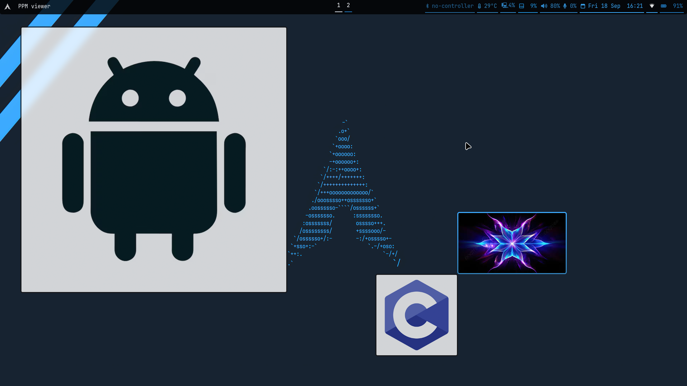

# Simple image viewer:

C-the-img (see the image) is a simple image viewer that only supports `binary format .ppm` files for now.


## Repo structure:

```sh
C-the-img/
├── assets
│   ├── abstarct.ppm
│   ├── android.ppm
│   ├── Clang.ppm
│   └── c-the-img_demo.png
├── LICENSE
├── Makefile
├── README.md
└── src
    ├── main.c
    ├── utils.c
    └── utils.h
```

## Building/Running:

- `make` compile the program
- `make run` run the example
- `make clean` delete the program
